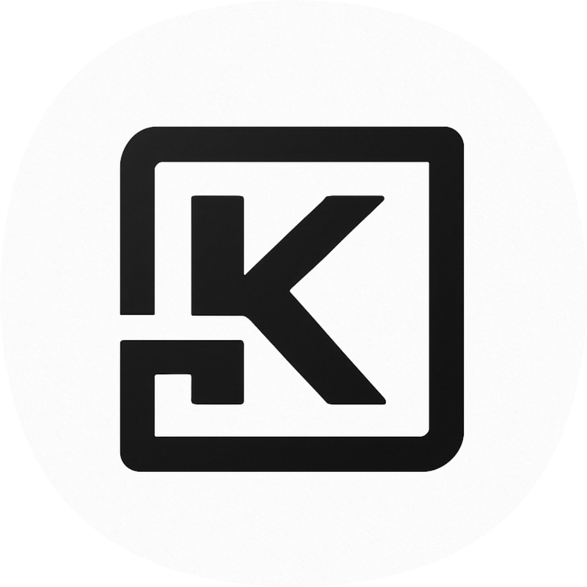
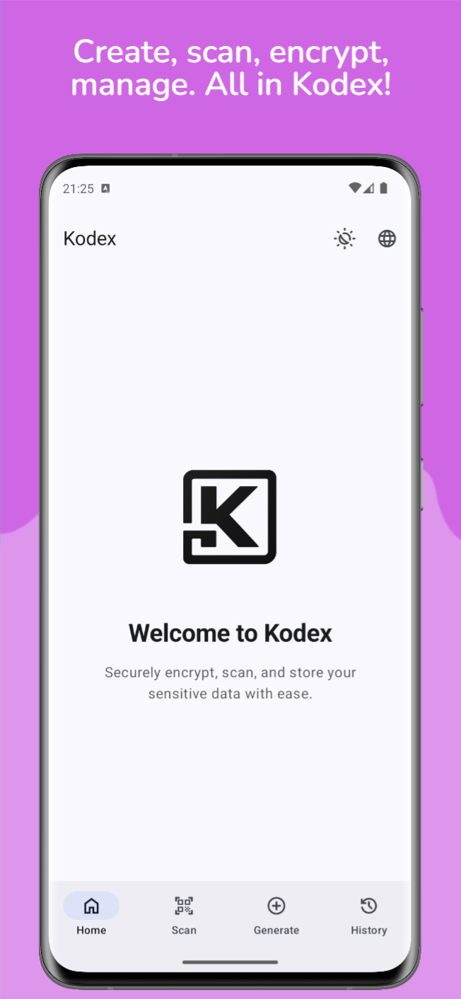
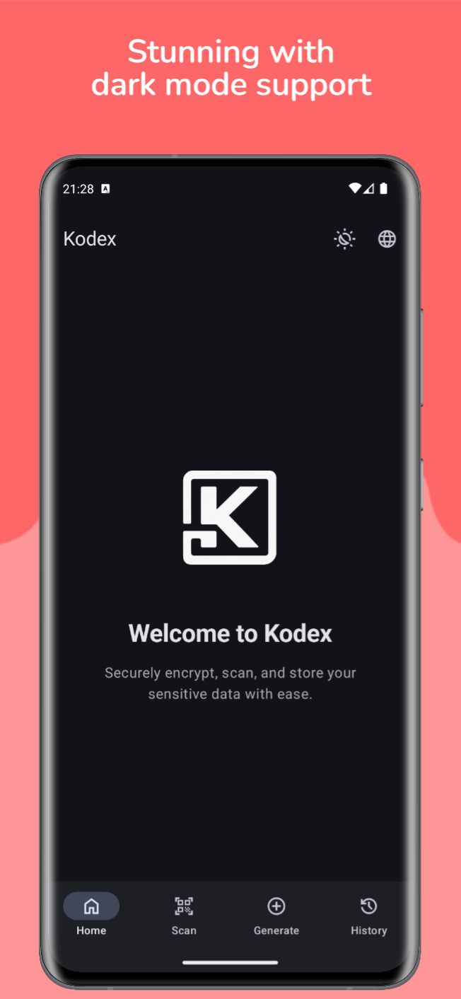
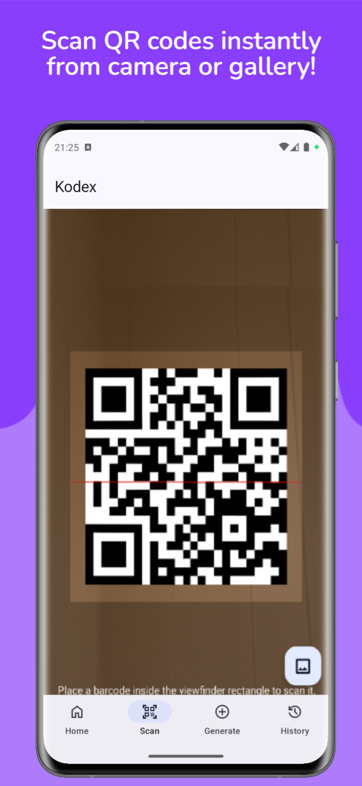
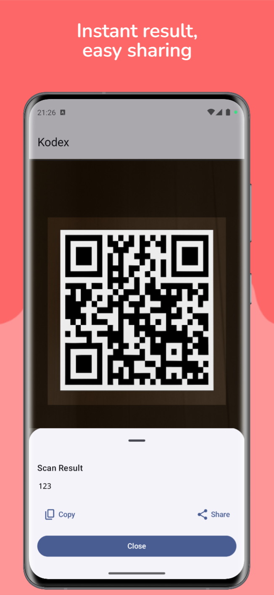
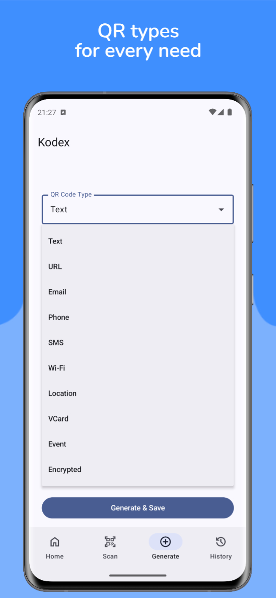
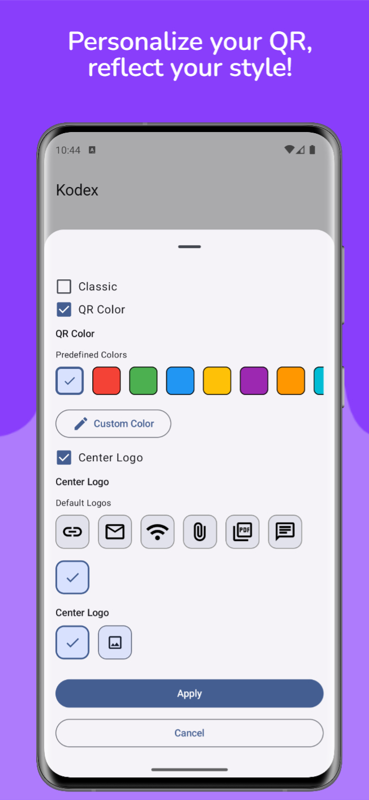
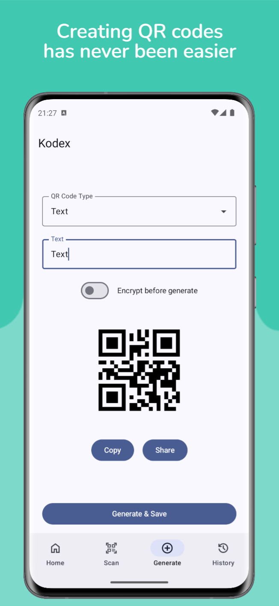
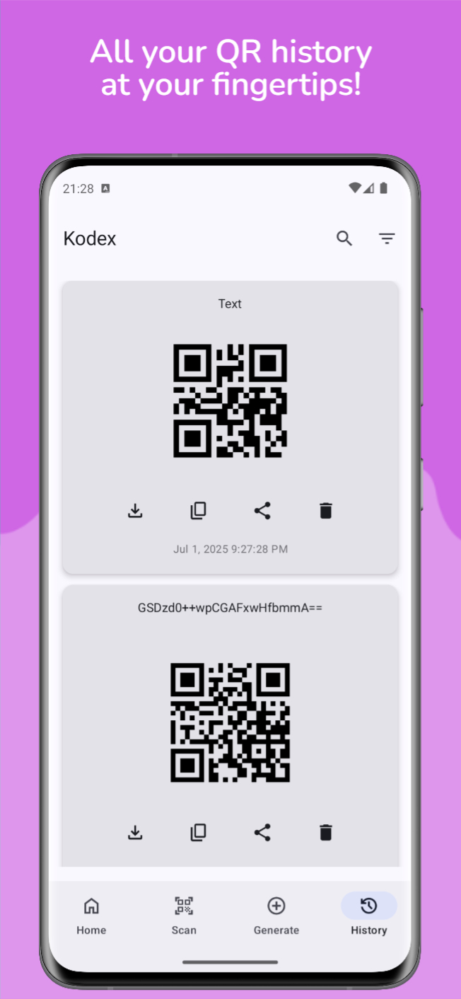

  

<h1 align="center">Kodex – QR Code Scanner & Generator</h1>

  <b>Fast · Secure · Customizable</b> 
  A modern QR application built with Jetpack Compose.

---

## 🔍 About

**Kodex** is a modern QR scanning and generation app focused on **customizable and secure QR creation**.  
Built with **Jetpack Compose**, providing a smooth UX and beautiful Material 3 design.

---

## 🚀 Core Features

### 📌 QR Operations
- Generate QR codes for:
    - Text, URLs, Contacts, Email, Wi-Fi, and more
- Scan using camera or images from gallery
- Support for **AES-encrypted QR codes**
- Save and share generated codes

### 🎨 Customization
- Change QR color + background color
- Add a **logo** into QR codes
- **3 customizable widgets** (Home Screen)
- **Quick Tile (Quick Settings)** scanner action
- **Startup behavior settings**
    - Continue from last screen
    - Always open home screen
    - Open a specific screen on launch

### 📦 Data & Storage
- Automatic scan history (Room Database)
- Local storage only — works **offline**
- No personal data tracking

---

## 🛠 Built With

| Layer       | Technology                      |
|-------------|----------------------------------|
| UI          | Jetpack Compose, Material 3      |
| QR Engine   | ZXing                            |
| Database    | Room + ViewModel                 |
| Encryption  | AES (CBC/PKCS5Padding)           |
| Widgets     | App Widgets + Compose Glance     |
| Analytics   | Firebase Analytics & Crashlytics |
| Language    | Kotlin (Compose-first)           |

---

## 📸 Screenshots

### 🏠 Home & Themes
| Light Mode | Dark Mode                   |
|------------|-----------------------------|
|  |  |

---

### 📡 QR Scanning
| Scanner View                | Scan Result                 |
|-----------------------------|-----------------------------|
|  |  |

---

### 🧾 QR Code Generation
| Type Selection              | Color & Logo Picker         |
|-----------------------------|-----------------------------|
|  |  |

| Create & Share              |
|-----------------------------|
|  |

---

### 📚 History & Saved Codes
| History                     |
|-----------------------------|
|  |

---

## 🧩 Architecture

The codebase is organized into distinct, domain-focused layers, clearly separating concerns (Presentation, Domain, and Data):

| Directory Name | Layer Responsibility | Description |
| :--- | :--- | :--- |
| `presentation/` | Presentation Layer | Houses all UI components, `ViewModel`s, and **Compose UI screens**. |
| `data/` | Data Layer | Manages interactions with all data sources (local/remote). Contains **Room Entities** and **DAO** (Data Access Objects). |
| `domain/` | Domain Layer | Contains the core business logic of the application. Defines **Models** and **Use Cases** for business rules. |
| `widgets/` | Specialized Components | Holds components outside the main application flow, specifically application **Widgets** built using **Glance**. |
| `features/` | Feature Modules | Contains feature-specific modules, such as QR Code **Generation** and **Scanning** functionality. |

---

## 🔐 Privacy & Security

> Kodex collects **no personal data**.  
> All operations run **locally on your device**, including encrypted QR creation.

✔ Offline  
✔ Secure AES Encryption  
✔ Local Database Only

---

## 🛣️ Roadmap

- 🟦 Gradient QR colors & backgrounds
- 🟦 QR templates (business cards, events, stickers)
- 🟦 Add emojis & decorative icons
- 🟦 Tag & filter QR items

---

## 📩 Contact

Created by **Mahmut Alperen Ünal**

- 🔗 GitHub: [github.com/mahmutaunal](https://github.com/mahmutaunal)
- 📨 Email: [mahmutalperenunal@gmail.com](mailto:mahmutalperenunal@gmail.com)

---

### 📌 Note
This repository is a **technical showcase only**.  
Source code of Kodex is **private**.
