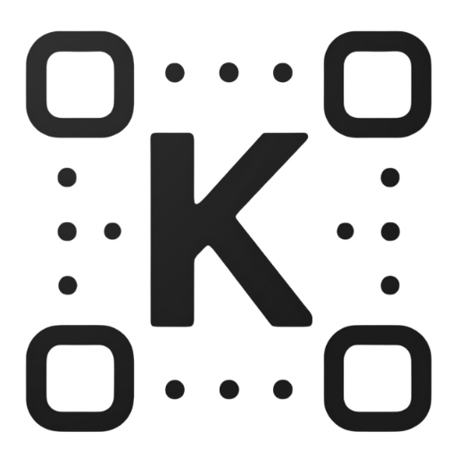
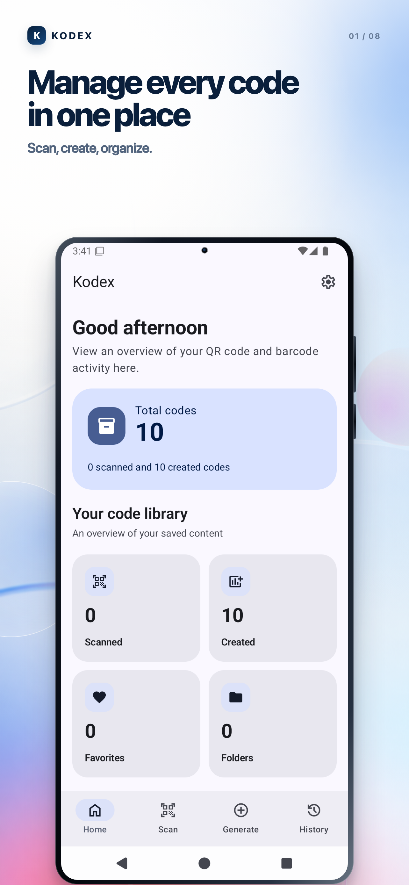
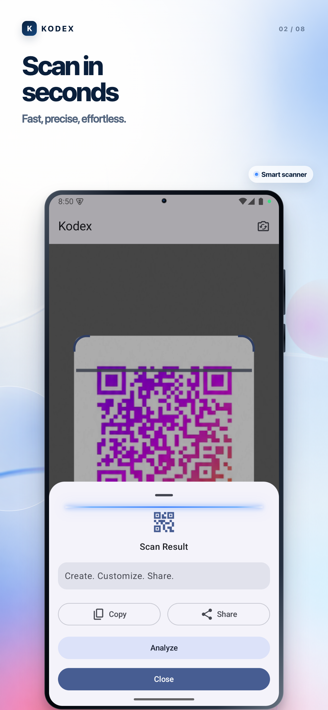
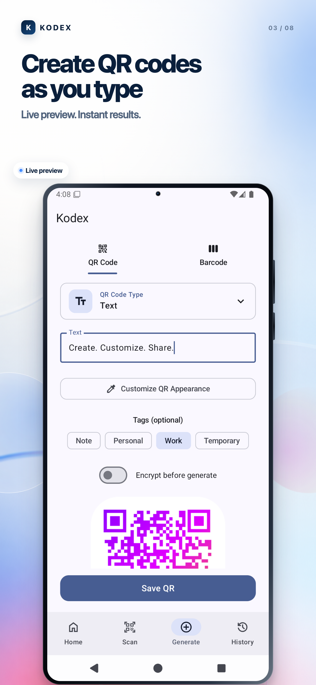
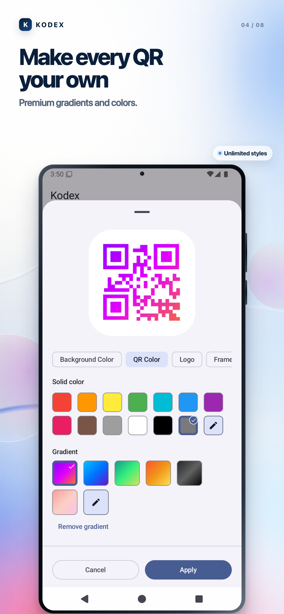
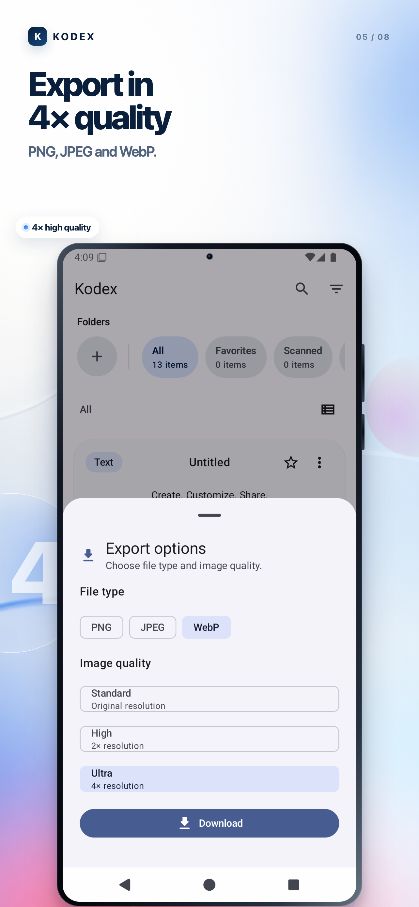
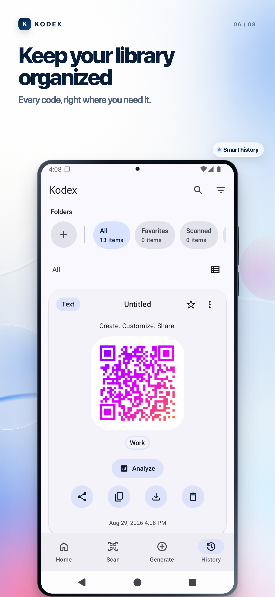
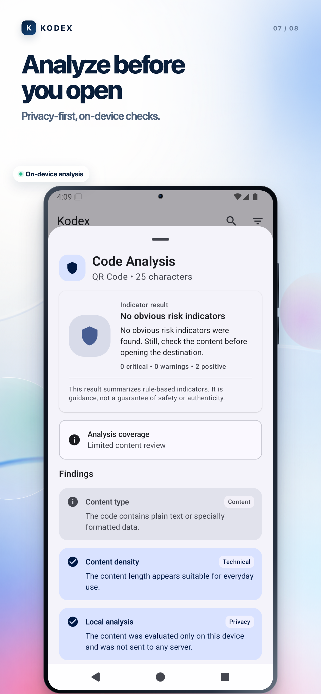
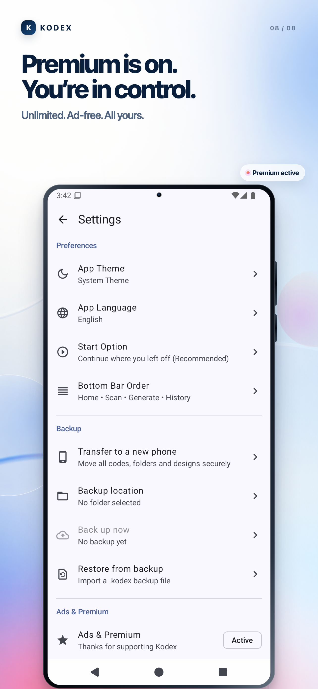

  

<h1 align="center">Kodex</h1>

  <strong>Scan smarter. Create beautifully. Keep every code under control.</strong>

  A modern, privacy-minded QR code and barcode toolkit for Android. 
  Scan, create, customize, analyze, organize, export, and share—all from one polished app.

  

  
  
  
  
  

---

## Your complete code toolkit

Kodex brings the full QR and barcode workflow into a single, focused experience. Point the camera at a code, create one from scratch, make it unmistakably yours, and keep everything organized for later.

It is built for quick everyday scans, polished business-ready codes, growing personal libraries, and anyone who wants more control than a basic scanner can offer.

## See Kodex in action

<table>
  <tr>
    <td width="25%"></td>
    <td width="25%"></td>
    <td width="25%"></td>
    <td width="25%"></td>
  </tr>
  <tr>
    <td width="25%"></td>
    <td width="25%"></td>
    <td width="25%"></td>
    <td width="25%"></td>
  </tr>
</table>

## Built around the entire code lifecycle

| Capture | Create | Keep |
| --- | --- | --- |
| Scan QR codes and barcodes with the camera or import an image from your gallery. | Generate QR codes and barcodes with a live preview and format-aware validation. | Save everything automatically, then find it through folders, favorites, tags, search, filters, and sorting. |
| Review useful actions for links, Wi-Fi, contacts, events, phone numbers, and more. | Customize colors, gradients, patterns, eye styles, frames, logos, icons, emoji, and images. | Edit saved codes, move them between folders, recover items from Trash, or share them in seconds. |

## More than a scanner

### Scan with context

Kodex recognizes QR codes and common barcode standards, then presents actions that match the detected content. Open a link, join a Wi-Fi network, add a contact or event, call a number, send a message, copy the value, or share it—all without unnecessary steps.

### Create codes that look like yours

Build QR codes for text, URLs, email, phone numbers, SMS, Wi-Fi, locations, contacts, calendar events, and encrypted text. A live preview keeps every change visible while you refine colors, gradients, patterns, frames, and center content.

Barcode creation includes format-aware input rules, automatic check digits where supported, readable-value controls, sizing options, and safe visual customization.

### Analyze before you act

The on-device analyzer helps you understand what a code contains before opening it. It summarizes content type, checks common link and formatting signals, validates supported barcode structures, and clearly explains the scope of each result.

Analysis is guidance—not a guarantee of safety or authenticity—but it gives you more context for an informed next step.

### Build a library, not a pile

Every scanned or generated code can become part of a searchable library. Use smart folders for favorites, scanned items, generated items, and Trash; add custom folders and tags; then filter by code type or barcode format whenever the collection grows.

### Export without compromise

Download or share your designs as PNG, JPEG, or WebP. Choose standard resolution, 2× high resolution, or 4× ultra resolution when you need sharper results for print, presentations, packaging, or digital campaigns.

### Move your data on your terms

Create local `.kodex` backups and restore them whenever needed. Device Transfer moves codes, folders, and designs through an encrypted package protected by a one-time 8-digit code—no account or cloud transfer is required.

## Privacy-minded by design

- No account is required.
- Your code library and organization data are stored locally.
- Code analysis runs on the device.
- Backup files are created only in a location you choose.
- Device Transfer uses an encrypted package instead of a cloud account.
- Camera access is used only for scanning, and the app can still be installed on devices without a camera.

## Premium, once

Kodex Lifetime Premium is a one-time purchase—no subscription.

Premium unlocks:

- An ad-free experience
- Custom foreground and background colors
- Multi-color gradients and advanced design tools
- Images from your device as QR center content
- High-resolution PNG, JPEG, and WebP exports up to 4×
- Unlimited code analysis
- Unlimited custom folders
- Unlimited Premium customization
- Future Premium design tools

## Supported formats

  
<strong>QR content types</strong>

  - Text
  - URL
  - Email
  - Phone
  - SMS
  - Wi-Fi
  - Location
  - Contact / vCard
  - Calendar event
  - Encrypted text

  
<strong>Barcode formats</strong>

  - EAN-13 and EAN-8
  - UPC-A and UPC-E
  - Code 128 and Code 39
  - ITF and Codabar
  - Data Matrix
  - Aztec
  - PDF417

## Made for Android

Kodex feels at home on modern Android devices with Material 3, dynamic color on supported versions, light and dark themes, configurable startup behavior, reorderable navigation, home-screen widgets, and a Quick Settings scanner tile.

The app supports Android 9 and newer and is localized in 17 languages:

English, Turkish, Arabic, Bengali, Chinese, French, German, Hindi, Indonesian, Italian, Japanese, Portuguese, Russian, Spanish, Swahili, Urdu, and Vietnamese.

## Product technology

Kodex is built natively for Android with:

- Kotlin and Jetpack Compose
- Material 3 and dynamic color
- CameraX and ML Kit Barcode Scanning
- ZXing-based QR and barcode generation
- Room and DataStore for local persistence
- WorkManager for reliable backup and restore operations
- Glance for home-screen widgets

## Get Kodex

Download Kodex from Google Play and turn every scan, code, and idea into something easier to understand, design, and manage.

  

## About this repository

This repository is an official product showcase for Kodex. The application source code is private and is not distributed through this repository.

Kodex is created by **AlpWare Studio**.

For support, partnerships, or product inquiries: [contact@alpwarestudio.com](mailto:contact@alpwarestudio.com)
