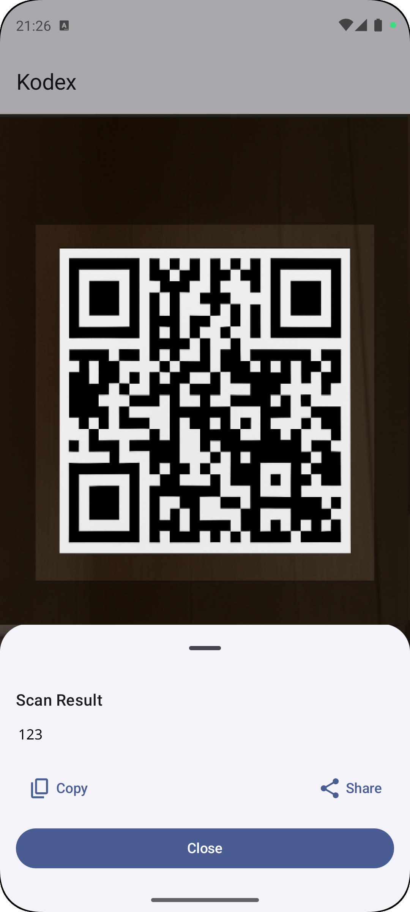

  

<h1 align="center">Kodex – QR & Barcode Scanner, Generator & Customizer</h1>

<b>Fast • Secure • Beautiful • Fully Customizable</b> 
Modern QR & Barcode toolkit built with Jetpack Compose.

---

# ✨ About

Kodex is a modern **QR Code & Barcode** application focused on creating beautiful, customizable and secure codes.

Whether you need to scan a QR code, generate a barcode, customize every visual detail or securely transfer your data to a new device, Kodex provides everything inside one elegant Material 3 experience.

Built entirely with **Jetpack Compose**.

---

# 🚀 Features

## 📱 QR & Barcode

- Generate QR Codes
- Generate Barcodes
- Scan QR Codes
- Scan Barcodes
- Scan from Camera
- Scan from Gallery
- Smart Scan Actions
- Edit previously created codes
- Analyze QR & Barcodes

Supported QR Types

- URL
- Text
- Email
- Phone
- SMS
- Wi-Fi
- Contact
- Location
- Calendar
- Cryptocurrency
- and more...

Supported Barcode Formats

- Code 39
- Code 93
- Code 128
- Codabar
- EAN-8
- EAN-13
- UPC-A
- UPC-E
- ITF
- PDF417
- Data Matrix
- Aztec

---

# 🎨 Customization

Create completely unique QR Codes.

### Colors

- Solid Colors
- Gradient Colors
- Custom Background Colors
- Gradient Backgrounds

### Design

- QR Patterns
- Eye Styles
- Decorative Frames
- Quiet Zone Control

### Center Content

- Logo Library
- Material Icons
- Emoji Library
- Custom Images

### Other

- Tags
- High Resolution Preview
- Live Preview
- Save Presets

---

# 📤 Export

Export your codes in multiple formats.

- PNG
- JPEG (Premium)
- WEBP (Premium)

Quality Options

- Standard
- High Resolution
- Ultra Resolution

Share directly from the application.

---

# 🔄 Data Management

- Automatic History
- Favorites
- Folder Management
- Smart Filtering
- Search
- Sorting

---

# 📂 Backup

- Export as .kodex
- Restore backups
- Offline backups
- Secure local storage

---

# 📲 Device Transfer

Move all your data safely.

- QR Codes
- Barcodes
- History
- Favorites
- Folders
- Settings

No cloud required.

---

# 🏠 Widgets & Shortcuts

- Home Screen Widgets
- Quick Settings Tile
- Dynamic Shortcuts

---

# 🎯 Personalization

- Material You
- Light Theme
- Dark Theme
- AMOLED Theme
- Startup Screen Selection

---

# 🔒 Privacy

Kodex is designed with privacy first.

✔ No account

✔ No cloud dependency

✔ Works offline

✔ Local database only

✔ AES encrypted QR support

---

# 🛠 Built With

| Layer | Technology |
|--------|------------|
| Language | Kotlin |
| UI | Jetpack Compose |
| Design | Material 3 |
| Barcode Engine | ML Kit + ZXing |
| Database | Room |
| Dependency Injection | Hilt |
| Background Tasks | WorkManager |
| Widgets | Glance |
| Analytics | Firebase Analytics |
| Crash Reporting | Firebase Crashlytics |

---

## 📸 Screenshots

### 🏠 Home & Themes

| Light Mode | Dark Mode |
|------------|-----------|
|  |  |

---

### 📡 QR & Barcode Scanning

| QR Scanner | Scan Result |
|------------|-------------|
|  |  |

---

### 🎨 QR & Barcode Creation

| Type Selection | Customization |
|----------------|---------------|
|  |  |

| Create | Share |
|---------|-------|
|  |  |

---

### 📚 History & Organization

| History | Saved Codes |
|----------|-------------|
|  |  |

| Folder Management |
|-------------------|
|  |

---

# 🔥 Premium

Premium unlocks advanced features including

- High Resolution Export
- JPEG Export
- WEBP Export
- Advanced Customization
- Future Premium Features

---

# 🛣 Roadmap

- iOS version
- Desktop version
- Wear OS support

---

# 📩 Contact

Created by

**AlpWare Studio**

Email

contact@alpwarestudio.com

---

# 📄 License

This repository is provided as a **technical showcase**.

The application source code is private and is not distributed publicly.
